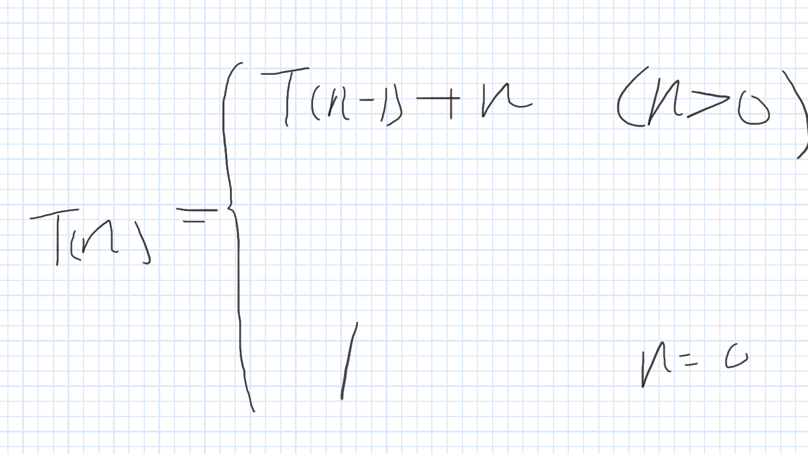
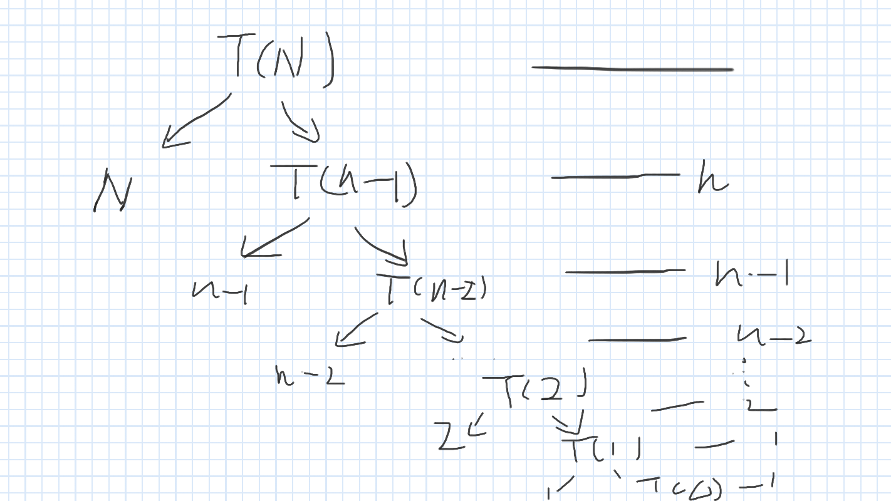
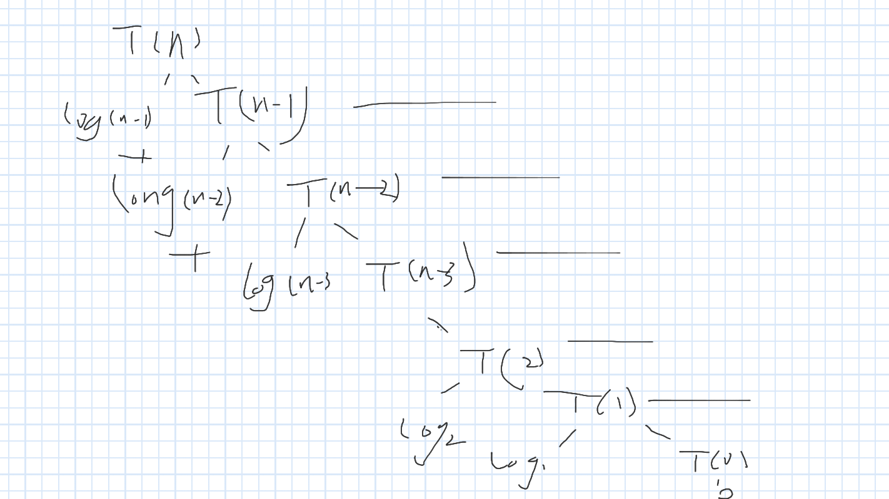
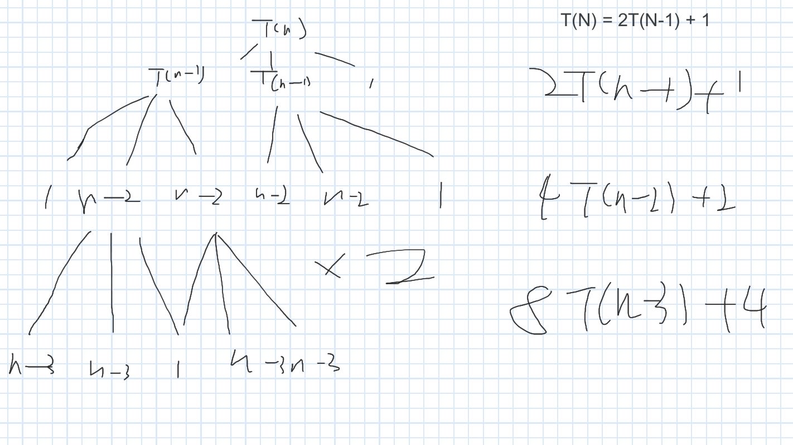
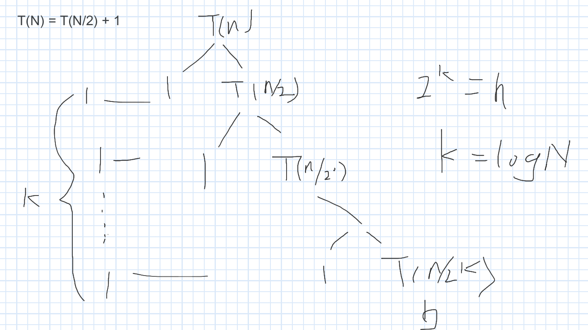
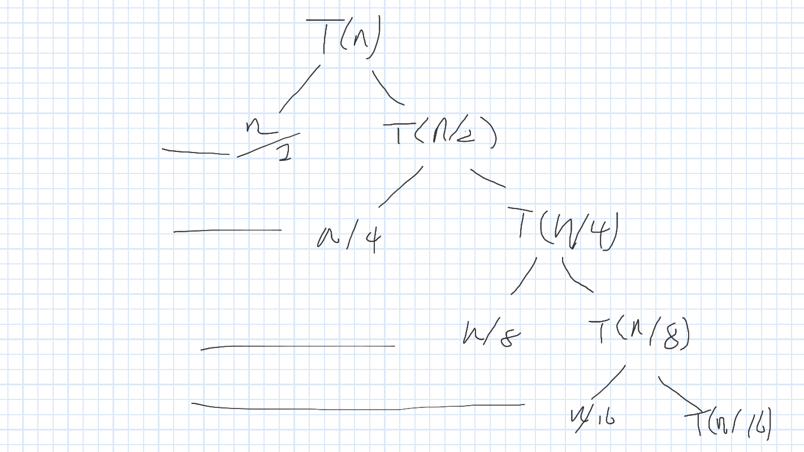
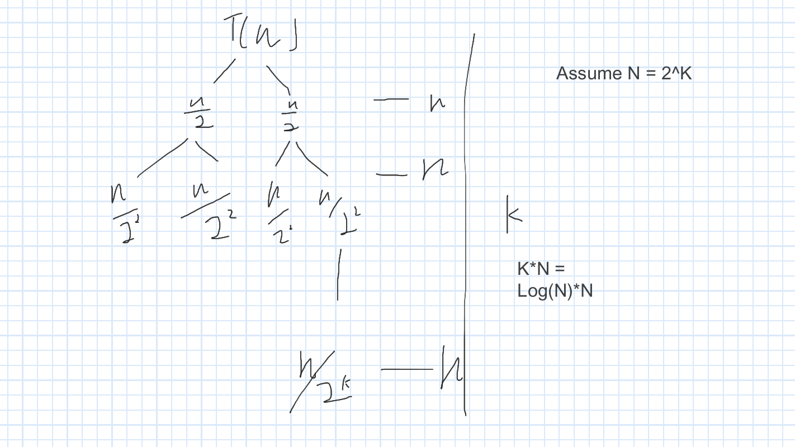
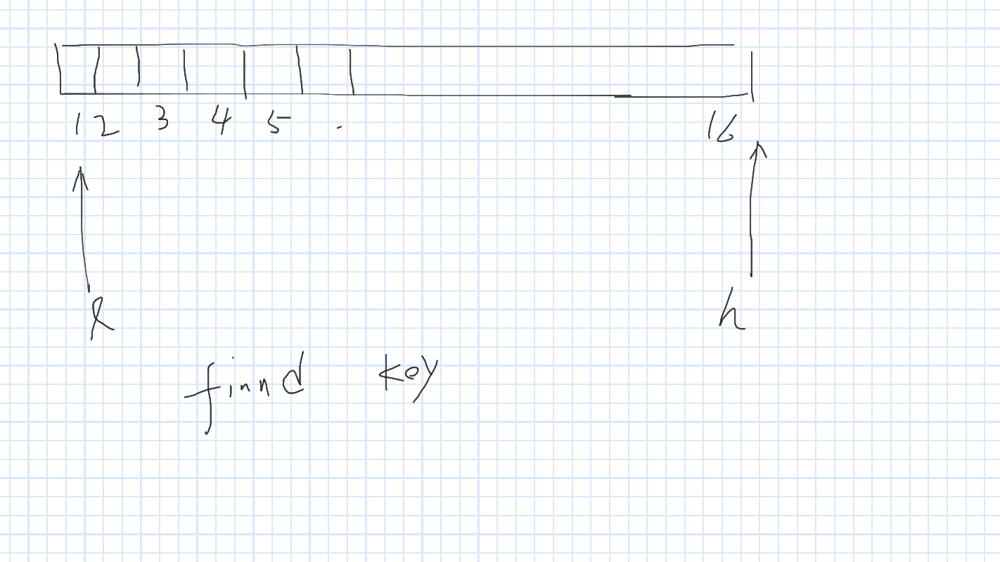

# The note of Algorithms
This is the note for an online YouTube course produced by [Abdul Bari](https://www.youtube.com/watch?v=4V30R3I1vLI&list=PLDN4rrl48XKpZkf03iYFl-O29szjTrs_O&index=19).

Using [Google jamboard](https://jamboard.google.com/?pli=1) to draw graph during my learning process.
# Chapters
## Chapter 2: Divide and Conquer 
### Lesson 1: Divide and Conquer
[The basic conception of divide and conquer](https://youtu.be/2Rr2tW9zvRg?feature=shared)
#### The whole idea of Divide and conquer and **combine**:
1. Split the problem into sub problems.
2. Solve the sub problems one by one, in order to get the answer of each sub problems.
3. **Combine** the answers into one answer, which is the most important thing in the whole process of solving the problem. 


#### The algorithm of DAC

```plaintext

DAC(P){
    if isSmall(P){
        Solve(P)
    }else{
        Divide P into P1,P2,P3
        Apply DAC(P1), DAC(P2), DAC(P3) 
        Combine(DAC(P1),DAC(P2),DAC(P3))       
    }
    
}

``` 

#### Examples of the Divide and Conquer Algorithm
1. Binary Search
2. Finding Maximum and Minimum 
3. Merge sort
4. Quick sort
5. Strassen's Matrix Multiplication


### Lesson 2.1.1: Recurrence Relation T(N) = T(N-1) + 1
The link of this lesson on YouTube on be found [here](https://www.youtube.com/watch?v=4V30R3I1vLI&list=PLDN4rrl48XKpZkf03iYFl-O29szjTrs_O&index=19)
The topic of the lesson is about how to trace the recurrence algorithm by using recurrence tree and formula, and how to calculate the time complexity of a recurrence relation.
The formula of the lesson is T(N) = T(N-1) + 1, meaning that the time complexity of the recurrence relation is O(N).

According to the answer of ChatGPT, the time complexity of a recurse algorithm can be linear or non-linear.
#### A Recurrence Relation represented by code

```plaintext
// Print the value of N recursively.
void Test(int n){
    if(n > 0){
        print(n)
        Test(n-1)
    }
}
```
1. Using recursion tree to trace and represent the recurrence relation

**IMPORTANT: Recursion tree is crucial important during this course,since it is a good way to visualize and analysis the recursion algorithm.**


From the draw, we can learn that the time complexity of this recurrence relation is O(N), since the function is called by N + 1 times.
2. Using recurrence formula to present the algorithm
```plaintext
void Test(int n){                      -- T(N)
    if(n > 0){                         -- 
        print(n)                       -- 1
        Test(n-1)                      -- T(N-1)
    }
}
------------------------------------------------------
------------------------------------   -- T(N) = 1 + T(N-1)
```
But how about the condition if(n > 0)? It is not listed in the formula?
How to prove the recurrence formula? 


```plaintext
T(N) = T(N-1) + 1

Substitute T(N-1) = T(N-2) + 1
so:
T(N) = [T(N-2) + 1] + 1
T(N) = T(N-2) + 2
T(N) = [T(N - 3) + 1] + 2 
T(N) = T(N - 3) + 3
....
T(N) = T(N - K) + K

Asssume : N - K = 0 , so N = K
then:
T(N) = T(0) + K
Because T(0) = 1
then:
T(N) = 1 + K
Because N = K
T(N) = 1 + N
```


### Lesson 2.1.2 Recurrence Relation T(N) = T(N-1) + N: 
The link of the lesson is [here](https://www.youtube.com/watch?v=IawM82BQ4II&list=PLDN4rrl48XKpZkf03iYFl-O29szjTrs_O&index=20)
The formula that needed to be proved in this lesson is T(N) = T(N-1) + N
```plaintext
// This is a code print 1 to N times during every single recurrence process.

Test(n){                                      -- T(N)
    if(n > 0){                                -- 
        for(i = 0;i < n;i++){                 -- N
            print(n)                          -- 
        }                                     -- 
        Test(n-1)                             -- T(N-1)
    }                                         -- 
}                                             -- 
                                              -- 
--------------------------------------------------
----------------------------------------------   T(N) = N + T(N-1)
```

How to get the time complexity of the formula T(N) = N + T(N-1)?
There are 2 ways of getting the complexity of the formula:
1. Drawing a recursion tree to present the whole recurrence relation.
2. Using formula to prove it.
The first step is to of prove the formula is to find the condition that a question is a sub question can be solved or not.
So we get the formula like this:



Solution 1 : Using recursion tree to visualize the recurrence relation.


So we can calculate time complexity of the whole recurrence relation :
```plaintext
T(N) = T(0) + 1 + 2 + 3 + ... + n - 2 + n -1 + n
T(N) =  T(0) + n(n-1)/2
T(N) = 1 + n(n-1)/2
T(N) = O(N^2)
```
Solution 2: Using the formula to trace the recurrence relation.
```plaintext
T(N) = T(N-1) + N
substitute: T(N-1) = T(N-2) + (N-1)
so 
T(N) = T(N-2) + (N-1) + N
substitute: T(N-2) = T(N-3) + (N-2)
so 
T(N) = T(N-3) + (N-2) + (N-1) + N

T(N) = T(N-K) + (N-(K-1)) + (N-(K-2)) + ... + (N-2) + (N-1) + N
assume N = K
T(N) = T(0) + (1) + (2) + (N-2) + (N-1) + N
T(N) = T(0) + 1 + 2 + ... + N
T(N) = T(0) + (N)(N-1)/2
T(N) = 1 + n(n-1)/2
T(N) = O(N^2)

```
### Lesson 2.1.3 Recurrence Relation T(N) = T(N-1) + log(N):
#### Find out the time complexity of formula T(N) = T(N-1) + log(N)
```plaintext
void test(N){                        -- T(N)
                                     -- 
    if(N > 0){                       --  
                                     -- 
        for(i=0;i<N;i=i^2){          -- Log(N)
            print(i)                 -- 
        }                            -- 
                                     -- 
        test(N-1)                    -- T(N-1)
    }                                -- 
}                                    -- 
-------------------------------------------
```

```plaintext

T(N) = T(N - 1) + Log(N) when N > 0
T(N) = 0
```
Solution 1: Using the recursion tree to solve the problem:

T(N) = log(N-1) + log(N-2) + ... log(3) + log(2) + log(1) + 0
T(N) = log((N-1) * (N-2) * 3 * 2 * 1) 
T(N) = Nlog(N)

Using substitute to solve the problem
```plaintext
T(N) = T(N-1) + Log(N)

since 
T(N-1) = T(N-2) + Log(N-1)
substitute T(N-1) 
then
T(N) = T(N-2) + Log(N-1) + Log(N)

since 
T(N-2) = T(N-3) + Log(N-2)
substitute T(N-2)
then
T(N) = T(N-3) + Log(N-2) + Log(N-1) + Log(N)
...
T(N) = T(N-K) + Log(N-(K-1)) +...+ Log(N-2) + Log(N)
assume T = K
then
T(N) = T(0) + Log(1) + Log(2) + ... Log(N)
T(N) = 0 + log(1) + log(2) ... + log(n)
T(n) = log(n*(n-1)*(n-2)*...2*1)
T(n) = nlogn
```
#### The complexity of T(N) = T(N-1) + f(N)

From the previous 3 courses, we learned that the time complexities of each algorithm are:
```plaintext
T(N) = T(N-1) + 1                       -- O(N)
T(N) = T(N-1) + N                       -- O(N^2)
T(N) = T(N-1) + logN                    -- O(NlogN)
```
then, we can get the conclusions are
```plaintext
T(N) = T(N-1) + N^2                     -- O(N^3)
T(N) = T(N-2) + 1                       -- O(N)

T(N) = T(N-100) + 1                     -- O(N)

```

we can get the conclusion as follows:
```text
The time complexity of the recurrence relation T(N) = T(N-1) + f(N) is

O(N*f(N))

```

### Lesson 2.1.4: Recurrence relation: T(N) = 2T(N-1) + 1
The algorithm:
```plaintext
void T(N){                           --  T(N)
    if(N>0){                         -- 
        print(N)                     --  1
        T(N-1)                       --  T(N-1)
        T(N-1)                       --  T(N-1)
    }                                -- 
}                                    -- 
```
The recurrence relation of the algorithm is 
```plaintext
T(N) = 2(N-1) + 1 when N > 0
T(N) = 1 when N = 0
```
There are 2 solutions to get the time complexity:
1. Solution 1: the recursion tree

```plaintext
T(N) = 1+2+4+...2^(N )
     = 2^(N+1) - 1
     = O(2^N)
```


2. Solution 2: the formula
```plaintext
T(N) = 2T(N-1) + 1
since 
T(N-1) = 2(N-2) + 1
substitute T(N-1)
then
T(N) = 2[2T(N-2)+1] + 1
T(N) = 2^2T(N-2) + 2 + 1

since
T(N-2) = 2T(N-3) + 1
substitute T(N-2)
then 
T(N) = 2^2[2T(N-3) + 1] + 2 + 1
T(N) = 2^3[T(N-3)] + 4 + 2 + 1

T(N) = 2^KT(N-K) + 2^(K-1) + ... + 2 + 1
assume N = K
T(N) = 2^NT(0) + 2^(K-1) + ... + 2 + 1
T(0) = 1
T(N) =  2^K+ 2^(K-1) + ... + 4 + 2 + 1
T(N) =  2^(K+1) - 1
T(N) = O(2^N)

```

### Lesson 2.2 Masters Theorem Decreasing Function: Part 1: T(N) = aT(N-b) + f(n)

**The masters theorem is crucial important, Abdul said that you should write this down at least one time to understand this.
Otherwise, you can't understand it just by watching.**

From previous lessons, we learned that
```plaintext
T(N) = T(N-1) + 1                   -- O(N)
T(N) = T(N-1) + N                   -- O(N^2)
T(N) = T(N-1) + log(N)              -- O(NlogN)
                                    -- 
                                    -- 
T(N) = 2T(N) + 1                    -- O(2^N)
T(N) = 3T(N) + 1                    -- O(3^N)
                                    -- 
                                    -- 
T(N) = 2T(N) + N                    -- O(N2^N)
```

Master theorem for decreasing function:
```plaintext
T(N) = aT(N - b) + f(n)
when a > 0, b > 0 ,f(n) = O(N^K) where K >=0 
```

cases:
1. a > 0 and a<1 
```plaintext
T(N) = O(N^K)

```
2. a = 1
```plaintext
T(N) = T(N-b) + f(n)
     = O(N*f(n))
     = O(N^(K+1))
```

3. a > 1
```plaintext
T(N) = O(N^K * a^N/b)
```
### Lesson 2.3.1 Recurrence relation dividing function T(n) = T(n/2) + 1
IMPORTANT The previous courses focus on using master theorem solving **decreasing function**, while the following courses
focus on solving **dividing function** using master theorem.

The previous courses solving the decreasing function is just warm-up, **the divide and conquer is more about dividing function with master theorem.**
```plaintext
void T(N){
    if(N > 1){
        print(N)
        T(N/2)     
    }
}


T(N) = T(N/2) + 1 when N > 1
T(N) = 0 when N = 1

```
1. Solution 1: recursion tree

The depth of the recursion tree is Log(N), and the time complexity is Log(N)
2. Solution 2: substitution method

```plaintext

T(N) =  T(N/2) + 1
substitute T(N/2) = T(N/2^2) + 1
T(N) = T(N/2^2) + 2
substitute T(N/2^2) = T(N/2^3) + 1
T(N) = T(N/2^3) + 3

....

T(N) = T(N/2^K) + K
assume N = 2^K
T(N) = T(1) + Log(N)
T(N) = Log(N)
```
The time complexity is Log(N)


### Lesson 2.3.2 Recurrence relation dividing function T(n) = T(n/2) + n
```plaintext

void T(N){
    if(N > 1){
        for(i=0;i<N/2;i++){
            print(i)
        }
        T(N/2)
    }
}

T(N) = T(N/2) + N/2 when N > 1
T(N) = 0 when N = 1
```

Solution 1:

Solution 2: substitution 
```plaintext
T(N) = T(N/2) + N/2
substitute T(N/2) = T(N/4) + N/4
T(N) = T(N/4) + N/4 + N/2
substitute T(N/4) = T(N/8) + N/8
T(N) = T(N/8) + N/8 + N/4 + N/2
...
T(N) = T(N/2^K) + N/2^K + ... + N/2
assume N = 2^K
T(N) = T(1) + 1 + N/2^(K-1) + N/^2(K-2) + ... + N/2
T(N) = T(1) + 1 + N*(1/2^(K-1) + 1/2^(K-2) + ... + 1/2)
T(N) = 1 + N

```

Time complexity is O(N)
### Lesson 2.3.3 Recurrence relation dividing function T(n) = 2T(n/2) + n

```plaintext
void T(N){
    if(N>1){
        for(i = 0;i<N;i++){
            print(i)
        }
        T(N/2)
        T(N/2)
    }
}

T(N) = 2(T/2) + N when N > 1
T(N) = 0 when N = 1
```

Solution 1: 


Solution 2:
```plaintext
T(N) =  2 * T(N/2) + N
substitute T(N/2) = 2 * T(N/2^2) + N/2
T(N) = 2 * [2 * T(N/2^2) + N/2] + N
T(N) = 2^2 * T(N/2^2) + 2N
substitute T(N/2^2) = 2 * T(N/2^3) + N/2^2
T(N) = 2^2 * [2 * T(N/2^3) + N/2^2] + 2N
T(N) = 2^3 * T(N/2^3) + 3N
...
T(N) = 2^K * T(N/2^K) + K*N
assume N = 2^K
T(N) = N * T(1) + LogN * N
T(N) = N * Log(N)

```

### Lesson 2.4.1 Masters Theorem of dividing function
### Lesson 2.4.2 Examples for Masters Theorem
### Lesson 2.5 Root Function
### Lesson 2.6.1 Binary Search Iterative


a[15] is a sorted Array, there two ways to find the position of the key.
```plaintext
a[15] = [12,3,...,13,14]
low = 1, high = 15
int BinarySearch(low,high,key){
    while(low<=high){
        mid = (low + high) / 2
        if(a[mid] == key)
            return mid
        if(key<a[mid])
            high = mid - 1
        else
            low = mid + 1
    }
    return -1
}

```
### Lesson 2.6.1 Binary Search Recurrence
```plaintext
int BinarySearch(low,high,key){
    // Is problem is small enough?                        -- T(N)
    if(low == high){                                      -- 3 when N = 1
        // solving the problem                            -- 
        if(key == a[low])                                 -- 
            return low                                    -- 
         else return -1                                   -- 
    }else if(low > high){
         return -1                                                     -- 
    } else{                                                 -- when N > 1
        // divide the problem into sub problems           -- 
        mid = (low + high)/2                              -- 1
        // apply sub problems                             -- 
        if(key == a[mid]) return mid                      -- 
        if(key > a[mid]){                                 -- 
            low = mid + 1                                 -- 1
            // combine                                    -- 
            return BinarySearch(low,high,keu)             -- T(N/2)
        } else{                                           -- 
            high = mid - 1                                -- or
            // combine                                    -- 
            return BinarySearch(low,high,keu)             -- T(N/2)
        }                                                 -- 
    }                                                     -- 
}                                                         -- 
------------------------------------------------------------ -------------

The recurrence relation of above algorithm is :
T(1) = 1 when N = 1
T(N) = T(N/2) + 1 when N > 1
Log(N)
```

## Practices
Leetcode Problems:
1. com.github.yck.SpecialArrayWithXElementsGreaterThanorEqualX

**Note**

- Always make sure what to search.
  * Define the relationship between the array you defined and the problem. Why you solve the problem by searching the array you define.
  * Make sure that you figure out the meaning of start and end of the array.
  * What is the sub-problem that can be solved? Also notice that for the sub problems,it is still possible that takes O(1)、O(N)、O(LogN) times to solve the problem.
- Binary Search iterative
  * mid = low + (high - low)
  * Using while(low<=high),do not call itself when search iterative.
- Binary Search Recursive
  * low == high meaning sub problem, can be solved.
  * low > high meaning, no answer.
  * low < high meaning needed to be divided into more sub problems;


## Chapter 3 Greedy method
## Chapter 4 Dynamic programming
## Chapter 5 Graph Traversals
## Chapter 6 Backtracking
## Chapter 7 Branch and Bound
## Chapter 8 NP-Hard and NP-Complete
## Chapter 9 KMP String matching
## Chapter 10 AVL Tree
## Chapter 11 B Tree and B+ Trees


